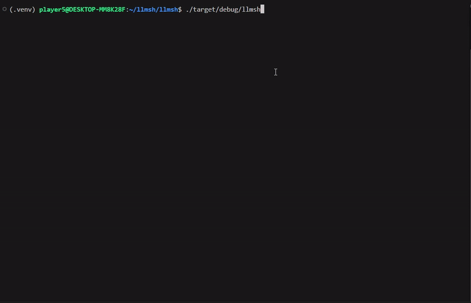

# llmsh
[](https://opensource.org/licenses/Apache-2.0)
[](https://github.com/maxyu1115/llmsh)

`llmsh` is a wrapper for your favorite shell, that comes with the llm-powered shell assistant/copilot `hermitd`. It is designed to work just like your underlying shell, except you can also input `:` to switch to a special prompt interface, where you can ask `hermitd` for help.

`hermitd` has full context of your current `llmsh` session, and can provide more insightful suggestions than asking a LLM directly. 

`llmsh` is also intended to provide an extremely convenient way to interact with a LLM.



## Setup
After cloning,
To install `llmsh`:
```shell
cd llmsh
cargo install --path <your desired destination>
```
To install `hermitd`:
```shell
cd hermitd
pip install .
hermitd-install
```

## How to run
Start `hermitd` with 
```shell
systemctl start hermitd
```
Then run
```shell
llmsh
```
This will wrap `$SHELL`. Or if you have a specific shell like `bash` in mind, run
```shell
llmsh bash
```

## Architecture
On a high level this is how things work:


Essentially `llmsh` uses a Pseudo Terminal to run a shell in it's child process, similar to how ssh operates. It then parses the user's shell interactions, and sends it to `hermitd` for context to augment llm generation. 

This was also the main reason `hermitd` takes the form of a daemon, compared to a server. `hermitd` was designed to always run on the same machine as `llmsh`, and if users run with a local llm, user's usage data should never leave your desktop.

**Also note that `llmsh` does not record keystrokes. It only sends hermitd what the terminal DISPLAYS, rather than what users input. So you don't need to worry about `llmsh` logging your passwords**

## Limitations
At the moment only LLM API calls to OpenAI and Anthropic are officially supported. Running LLM's locally are supported for developers, but currently don't have very clear steps on how to set up. (Essentially need things like a GPU, CUDA, vLLM, etc.) Hence local LLM usage is not "officially supported".

Currently this project only supports Linux and bash, due to how `llmsh` relies on OS specific ways to interact with the PTY, as well as shell specific ways to parse the output from the shell.

Because `llmsh` used the `nix` crate extensively, MacOS should be relatively easy to support. Windows on the other hand is a different beast, worst case we will need to rewrite llmsh just to support windows.

Shells similar to bash should be easy to support, other shells that are too different may face challenges. 

Contributions are incredibly welcome!
