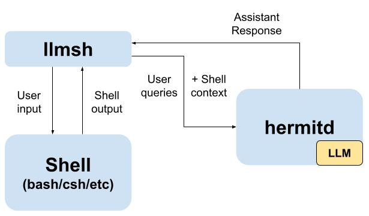

# llmsh
`llmsh` is a wrapper for your favorite shell, that comes with the llm-powered shell assistant/copilot `hermitd`. It is designed to work just like your underlying shell, except you can also input `:` to switch to a special prompt interface, where you can ask `hermitd` for help.

`hermitd` has full context of your current `llmsh` session, and can provide more insightful suggestions than asking a LLM directly. 

`llmsh` is also intended to provide an extremely convenient way to interact with a LLM.

On a high level this is how things work:


## Setup
After cloning,
To install `llmsh`:
```shell
cd llmsh
cargo install --path <your desired destination>
```
To install `hermitd`:
```shell
cd hermitd
pip install .
hermitd-install
```

## How to run
Start `hermitd` with 
```shell
systemctl start hermitd
```
Then run
```shell
llmsh
```
This will wrap `$SHELL`. Or if you have a specific shell like `bash` in mind, run
```shell
llmsh bash
```
